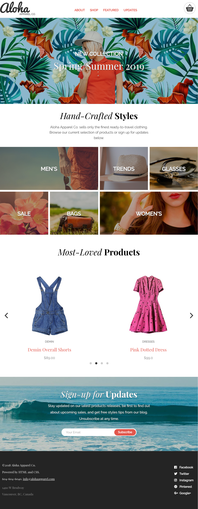

# Project: Aloha
----
## Goals of the site
Aloha is a responsive website, who uses CSS, HTML and JavaScript

----
## Technology used
HTML5 | SASS | Media Queries | JQuery | Git | JavaScript |

----
## JavaScript  features
JQUERY and Ajax | API  | Event handlers | ES6 | OOP |

----
## Personal Learnings

1. JQuery Events, DOM, Methods, Ajax and oriented object programming
2. JS 
3. SCSS with Grid

----
## Link to the files on Github
* **[ALOHA](https://paulpetillot.github.io/NewAloha/)
----
## Device Screenshots
**Desktop**
---- 

**Tablet**
----

**Mobile**
----

----

## Author

* **Paul Petillot**

https://github.com/PaulPetillot

